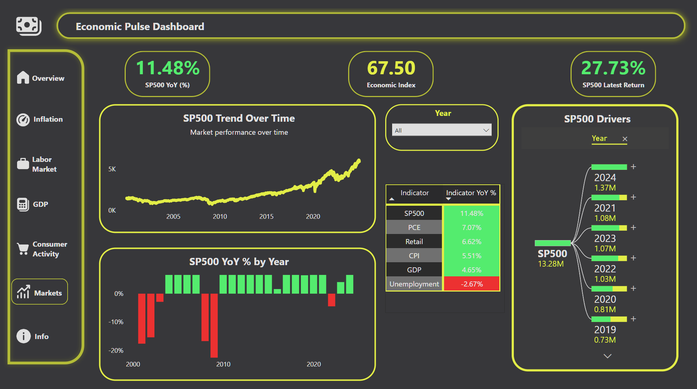

# 📊 U.S. Economic Dashboard (Power BI)

## Overview
This project is a multi-page Power BI dashboard designed to analyze U.S. economic conditions using key macroeconomic and financial market indicators.  
The dashboard focuses on **trend analysis**, **year-over-year (YoY) comparisons**, and **driver exploration** through interactive visuals and decomposition trees.

The goal of this project is to demonstrate:
- Practical data modeling skills
- Clear economic storytelling
- Advanced Power BI features (DAX, YoY/MoM calculations, decomposition trees)
- Professional dashboard design suitable for business and analyst audiences

---

## Dashboard Pages

### **Overview**
High-level summary of overall economic conditions using a custom **Economic Index** and key indicators.

---

### **Inflation**
Analysis of inflation dynamics using CPI trends, YoY changes, and driver decomposition.

---

### **Labor Market**
Focused view of unemployment trends, YoY changes, and labor market drivers.

---

### **GDP**
Economic growth analysis featuring GDP trends, YoY volatility, and macroeconomic context.

---

### **Consumer Activity**
Consumer behavior analysis using Retail Sales and PCE trends, YoY comparisons, and decomposition.

---

### **Markets**
Market performance analysis centered on the S&P 500, including trends, YoY returns, and performance drivers.

---

### **Data Sources & Methodology**
Documentation of data sources, modeling approach, and analytical limitations.

---

## Data Sources

All data used in this dashboard comes from publicly available U.S. economic and financial sources:

- **Consumer Price Index (CPI):** U.S. Bureau of Labor Statistics (BLS)
- **Unemployment Rate:** U.S. Bureau of Labor Statistics (BLS)
- **Gross Domestic Product (GDP):** U.S. Bureau of Economic Analysis (BEA)
- **Personal Consumption Expenditures (PCE):** U.S. Bureau of Economic Analysis (BEA)
- **Retail Sales:** U.S. Census Bureau
- **S&P 500 Index:** Public market data sources

Datasets were cleaned, standardized, and aligned to a common calendar table to enable consistent time-based analysis.

---

## Methodology

- A centralized **calendar table** was used to synchronize indicators reported at different frequencies (monthly and quarterly)
- **Year-over-Year (YoY)** and **Month-over-Month (MoM)** metrics were calculated using DAX measures
- Conditional formatting was applied per indicator to highlight positive and negative movements
- **Decomposition Trees** were used to explore relationships between macroeconomic indicators
- A custom **Economic Index** was created using a weighted composite of key indicators to summarize overall economic conditions
- Visual design emphasizes trends, volatility, and relative performance rather than raw point-in-time values

---

## Notes & Limitations

- Economic indicators are reported at varying frequencies and were standardized where appropriate
- Market data reflects historical performance and does not imply future outcomes
- The Economic Index is an analytical tool and not an official economic measure
- Relationships shown are exploratory and do not imply causation

---

## Files Included

- `U.S. Economic Dashboard.pbix` – Power BI dashboard file  
- `Economic_Dashboard.pdf` – Static PDF export for quick viewing  
- `README.md` – Project documentation  
- `/screenshots` – Preview images of dashboard pages

---

## Skills Demonstrated

- Power BI data modeling
- DAX (YoY, MoM, composite measures)
- Time-series analysis
- Economic indicator analysis
- Dashboard design & storytelling
- Data documentation and methodology writing

---

## Author

**Javier Pastor**  
Aspiring Data Analyst  
Skills: Power BI, DAX, SQL, Python, Excel
